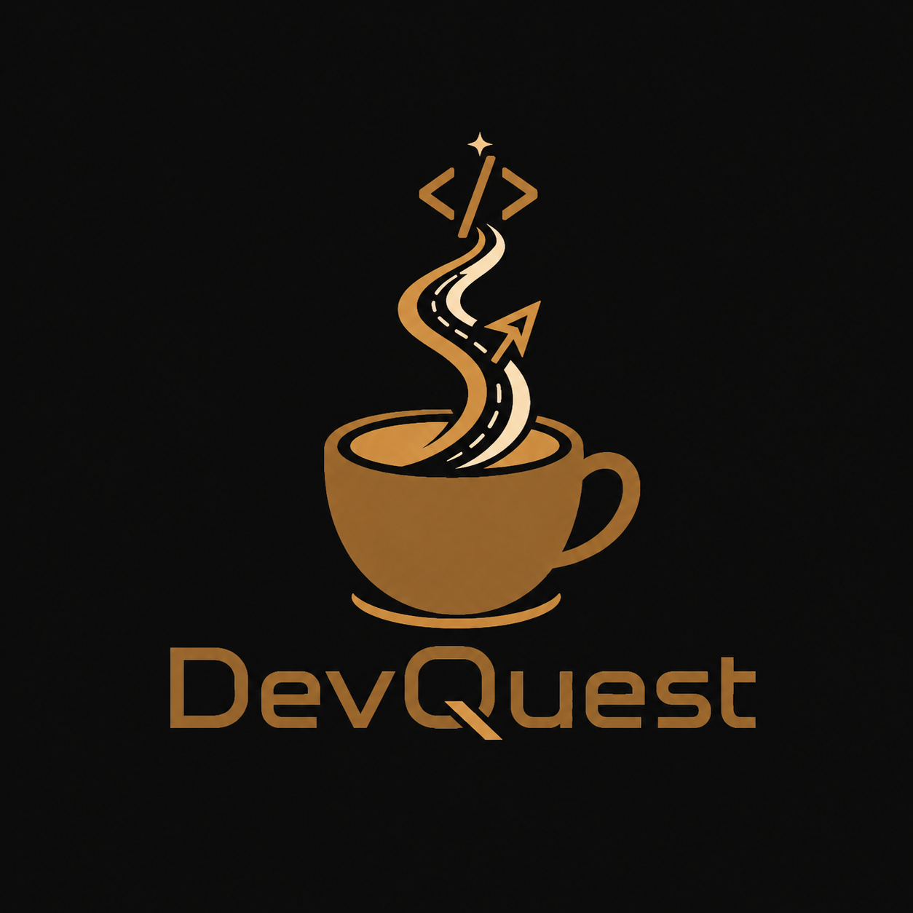
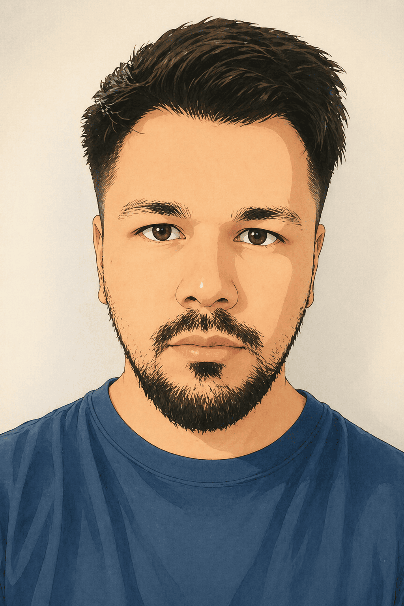

<p align="center">
  <picture>
    <source media="(prefers-color-scheme: dark)" srcset="./LOGO_DARK.png" />
    <source media="(prefers-color-scheme: light)" srcset="./LOGO_LIGTH.png" />
    
  </picture>
</p>

<h1 align="center">Daniel Gonzalez</h1>

<p align="center">
  <b>Software Developer &nbsp;·&nbsp; .NET & Vue.js &nbsp;·&nbsp; SaaS Builder &nbsp;·&nbsp; AI-Assisted Engineering</b>
</p>

<p align="center">
  
</p>

<br/>

<p align="center">
  
</p>

---

## About Me

I'm a software developer focused on building practical, maintainable and scalable web applications oriented to real business needs.

My core stack is **.NET / ASP.NET Core** on the backend and **Vue 3 + Quasar Framework** on the frontend. I care about clean architecture, solid design decisions and shipping things that work reliably in production.

Currently building **SuperStock** — a multi-tenant SaaS for stock, sales and retail management — and growing my engineering identity under the **DevQuest** brand.

I also incorporate **AI-assisted development** tools into my workflow, using them as engineering amplifiers to move faster without sacrificing quality.

---

## Currently Working On

- 🏗️ **SuperStock** — multi-tenant SaaS for retail stock and sales management
- 🌐 **DevQuest Portfolio & Blog** — personal landing, project showcase and technical writing
- 🧱 Deepening backend architecture with .NET: Clean Architecture, multi-tenancy, scalability
- 🤖 Building repeatable workflows with AI-assisted engineering tools
- 📝 Documenting my learning process and sharing practical software engineering content

---

## Tech Stack

**Backend**


REST APIs &nbsp;·&nbsp; Clean Architecture &nbsp;·&nbsp; Multi-tenant systems

**Frontend**


**Databases**


**DevOps & Infrastructure**


**AI-Assisted Development**


Prompt engineering &nbsp;·&nbsp; AI-driven code review &nbsp;·&nbsp; Automated documentation

---

## Featured Projects

### 🗃️ SuperStock
> Multi-tenant SaaS for stock, sales and retail management

A production-grade platform built for real business operations.

| Area | Details |
|---|---|
| **Backend** | ASP.NET Core · Entity Framework Core · PostgreSQL |
| **Frontend** | Vue 3 · Quasar Framework · TypeScript |
| **Infrastructure** | Linux VPS · Nginx · Cloudflare · Cloudflare R2 |
| **Architecture** | Multi-tenant · Clean Architecture · REST API |

Key features: inventory management · sales tracking · digital product catalogs per business · per-tenant configuration · cloud image storage

`Private repository — active development`

---

### 🌐 DevQuest — Portfolio & Blog
> Personal engineering hub: portfolio, technical blog and learning journal

- Professional showcase of real projects
- Technical writing and engineering notes
- AI-assisted development documentation
- Foundation for future professional opportunities

`<!-- PLACEHOLDER: https://devquest.dev — coming soon -->`

---

## AI-Assisted Engineering

I use AI tools as **engineering amplifiers**, not as replacements for technical judgment.

In practice this means:

- Analyzing legacy codebases and identifying refactoring paths
- Generating structured implementation plans before writing code
- Reviewing architecture decisions and validating against Clean Architecture principles
- Applying YAGNI, DRY and maintainability checks consistently
- Automating repetitive technical tasks with prompt-driven workflows
- Improving and structuring technical documentation

The goal is always the same: ship better software, faster, with more clarity and less noise.

---

## DevQuest

```
> DevQuest initialized...
> Loading: code, coffee, continuous growth.
> Status: building.
```

DevQuest is my personal brand and my engineering journey.

It represents a simple idea — that discipline, curiosity and craft compound over time. Not just writing code, but making decisions, solving real problems and growing with every project.

> **Code. Coffee. Continuous growth.**

---

## GitHub Stats

<p align="center">
  
  
</p>

<p align="center">
  
</p>

---

## Connect

| | |
|---|---|
| 💼 **LinkedIn** | `<!-- PLACEHOLDER: https://linkedin.com/in/YOUR_USERNAME -->` |
| 🌐 **Portfolio** | `<!-- PLACEHOLDER: https://devquest.dev — coming soon -->` |
| 📝 **Blog** | `<!-- PLACEHOLDER: https://blog.devquest.dev — coming soon -->` |
| 📧 **Email** | `<!-- PLACEHOLDER: your@email.com -->` |

---

<p align="center">
  <sub>Built with discipline and coffee &nbsp;·&nbsp; <b>DevQuest</b> © 2025</sub>
</p>
